## Author
    Aliya Summers
# Table of Contents

   challenge 01 - reverse array
        [link to first challenge](./challenges/array_reverse)

   challenge 02 - shift an array
        [link to second challenge](./challenges/array_shift)

   challenge 03 - binary search array
        [link to third challenge](./challenges/array_binary_search)

   challenge 05 - singly linked list
        [link to fifth challenge](./data-structures/linked_list)

   challenge 06 - linked list insertions
        [link to sixth challenge](./data-structures/linked_list)

   challenge 07 - linked list kth value from end
        [link to seventh challenge](./data-structures/linked_list)

   challenge 08 - linked list - merge/zip list
        [link to eighth challenge](./data-structures/linked_list)

   challenge 10 - stacks and queues
        [link to tenth challenge](./data-structures/stacks_and_queues)

   challenge 11 - queue with stacks
        [link to eleventh challenge](./challenges/queue_with_stacks)

   challenge 12 - FIFO animal shelter
        [link to twelfth challenge](./challenges/fifo_animal_shelter)
     
   challenge 13 - Multi Bracket Validation
        [link to thirteenth challenge](./challenges/multi_bracket_validation)

   challenge 14 - Binary Search Tree - add and search
        [link to fourteens challenge](./data-structures/tree)

   challenge 15 - Fizz Buzz Tree
        [link to fizz buzz tree](./challenges/fizzbuzz_tree)

   challenge 16 - Bread First Tree
        [link to fizz buzz tree](./challenges/breadth_first_tree)
     
   challenge 17 - Max Value in Tree
        [link to max tree value](./challenges/maximum_tree_value) 

   challenge 30 - Hash table
        [link to hash table](./data-structures/hashtable) 

   challenge 32 - Repeating words
        [link to repeating words](./challenges/repeated_word)

   challenge 33 - Tree Intersection
        [link to tree duplicates](./challenges/tree_intersection)
     
   challenge 34 - Left Join Hash Tables
        [link to left join hash table](./challenges/left_join)

   challenge 35 - Graph
        [link to graph implementation](./data-structures/graph)

# Reverse an Array
We were given instructions to write a function that will reverse a list or array.

Tammy Do, my partner for this challenge, helped me figure out the syntax of writing the function after I started testing my solution.

## Challenge
The challenge was to reverse an array. We had example input and output.

## Approach & Efficiency
I took what I saw at the shortest approach, and sliced the array one step at a time from back to front, so that it will reverse when printed. I may be wrong, but I believe this operates at O(1). 

## Solution
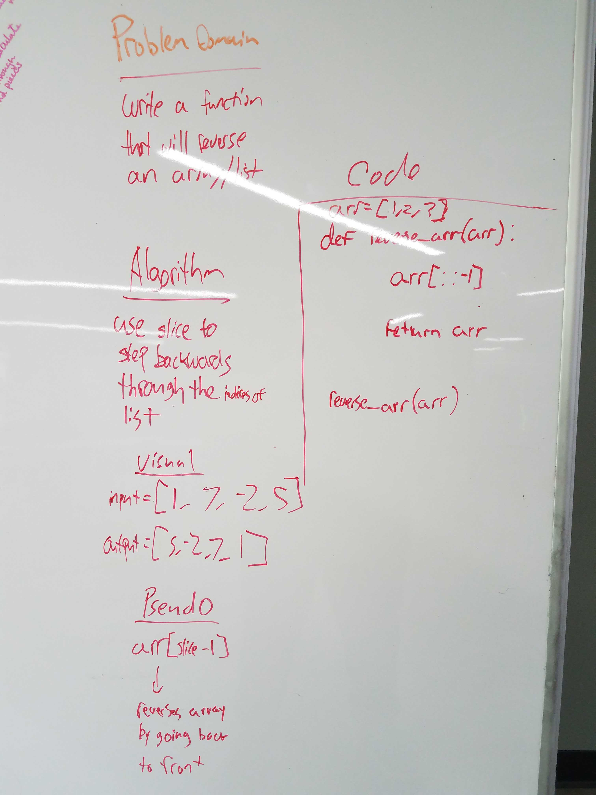

# Insert and Shift an Array
The instructions were to write a function that accepts an array/list and a value, and insert that value into the midpoint of the array.

Richard von Hagel was my partner for this challenge. He provided a few suggestions while I whiteboarded, and was helpful in talking through my solution.

## Challenge
I had to insert a value (in this case I used the number 7 across the board), into an array at the halfway point, and return the modified array. I wrote tests to see if the function worked.

## Approach & Efficiency
I utilized if/elif statements and integer division to verify my desired input. I then used Python's split function to modify and reconnect my arrays.

## Solution
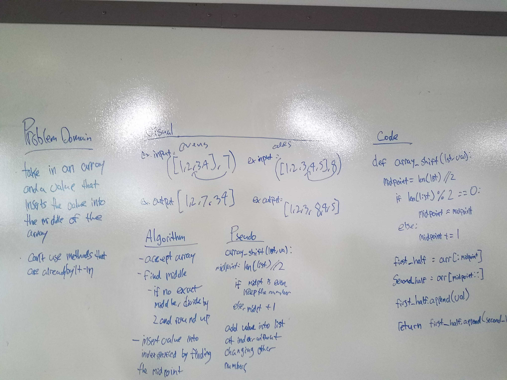

# Array Binary Search
Write a function that finds the given key value in an array by accessing various points in the array until it hits.

## Challenge
Write a function that takes in a list and a value. It should search for the value in the list, and return the index number of that value. If the value does not exist, return -1. Do not use python's built-in functions (like index()) to solve this.

## Approach & Efficiency

My whiteboarding partner for this lab was Tammy Do. We discussed approaches with each other for each of our whiteboarding turns.

After puzzling over this, we consulted the  provided in the assignment.
## Solution
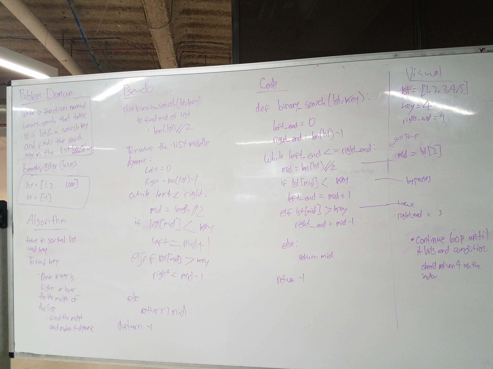

# Singly Linked List
Create and write some methods for a singly linked list

## Challenge
Create a Node class and a LinkedList class. Write a function that adds values onto nodes in the list, checks to see if other values exists on nodes in the list, and returns the value of the list in string form.

## Approach & Efficiency

I started by writing some of my tests and modeling them after the class demo on linked lists. I wrote tests, built parts of the app to pass the tests, then wrote more tests, et cetera. Found the algorithm for the includes_val function from . TA Evy also helped me conceptualize it. Joshua Ho helped guide me on the right path with the __str__ function.

I found my list of animals to pull from for my tests 

I am still learning big O notation, but I believe this runs ar O(N)

## API

insert() adds a node with a given value to the beginning of the linked list. It also allows adding multiple nodes at once.

includes_val() checks against a given term, to see if it exists as a value on any node in the linked list. I adapted the name from just being includes(), so as to avoid accidentally invoking python's built-in .includes() method.

__str__() converts the values of the linked list into a readable string, so it can be compared and tested against.

# Linked List - Insertion Methods
Create and write some methods to insert values are various places in a singly linked list

## Challenge
Create a Node class and a LinkedList class. Write functions that add values to the end of the list, before and after a given point in the middle of the list, and into an empty list

## Approach & Efficiency

I worked off my previously written insert function to start building my lists to work with. My append function is working well. I tried a few different ways to write the functions that access a value, and add a node either before or after the given value, but no luck yet. I sought assistance from James my TA, and JB, my instructor, as well as this  page.

## Solution

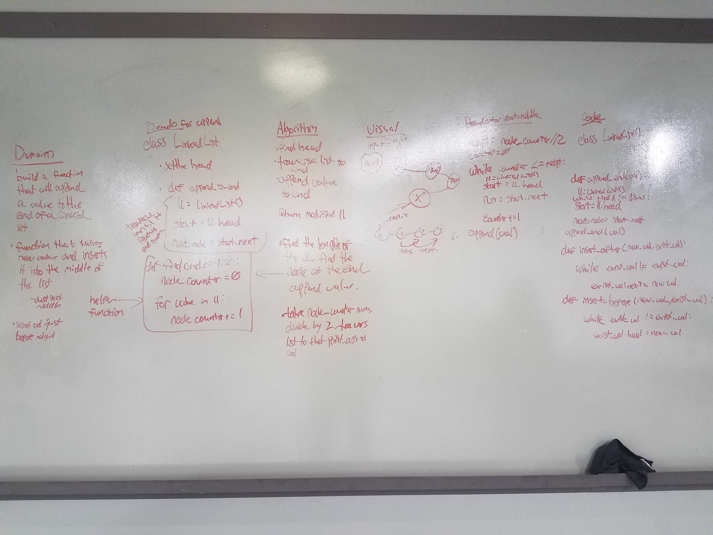

# Linked List - Kth from end
A method that returns the value of a node a given number of spaces from the end of a linked list

## Challenge
Create a method for the linked list that takes in a number, k, and finds the value of the node that is that many from the end. As an example, 0 from the end would just be the end of the list.

## Approach & Efficiency

Worked off of previously written linked list code. Started with some counters and two while loops. The first while loop calculated the length of the entire linked list. The second while loop used the values from the first to calculate where to end the loop and return the correct value. Whiteboarding sample does not include edge cases.

## Solution

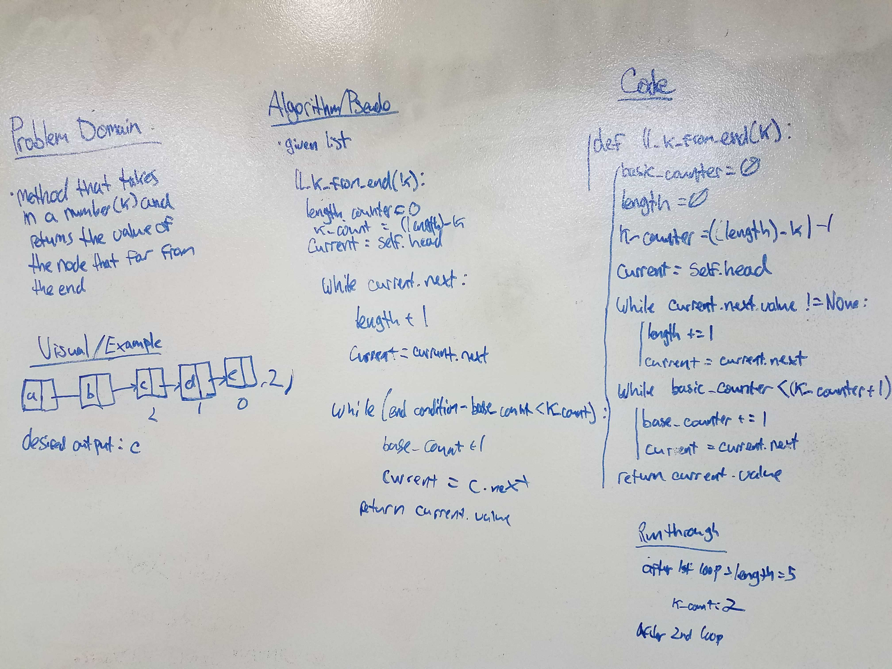

# Linked List - Merged List
A method that takes two linked lists and merges them together, returning the head of the modified list

## Challenge
A method that takes two linked lists and merges them together, returning the head of the modified list

## Approach & Efficiency

Worked off of previously written linked list code. Tried to switch around the head and next values of the two lists, but that didn't work, so I consulted 

I'm still not sure the list is actually merging, or how to incorpate the second list.

## Solution

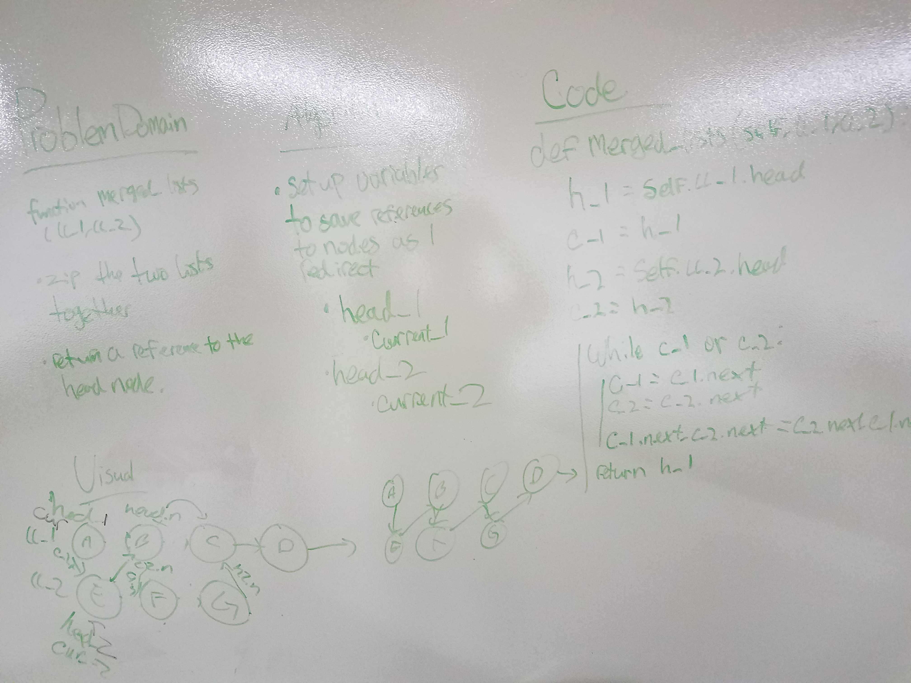

# Stacks and Queues
Create a stack and a queue from a Linked List, and write the basic functions to read and navigate them.

## Challenge
Create a Node class,  LinkedList class, a Stack class, and a Queue class. Write a functions that insert values into the Stack and Queue, examine the first ones in the list, and remove values

## Approach & Efficiency

I wrote my base Node and Linked List class after the demos from lecture. My Stack functions most rely on information from class, and . I learned how to write my Queues functions from 

These should run at O(N)

## API

Stacks are First In, Last Out. Peek() views the top node in the stack. Pop() removes nodes from the stack. Push() adds nodes to the stack.

Queues are First In, First Out. Like Peek() for Stacks, Peek() for Queues views the first node. Enqueue adds a node to the queue. Dequeue removes nodes.

# Stacks and Queues - Queue of Two Stacks
Create a pseudo queue class using two stacks

## Challenge
use the pop, push, and peek functions in a stack class to create an enqueue and dequeue function

## Approach & Efficiency
refactored and rewrote stack functions from 
Skyler Burger helped explain pytest fixtures to me a couple days ago. I am using them here.
Still need to refactor dequeue until it works as it should. Right now, the second stack isn't refilling with the stuff I popped from the first stack

## Solution

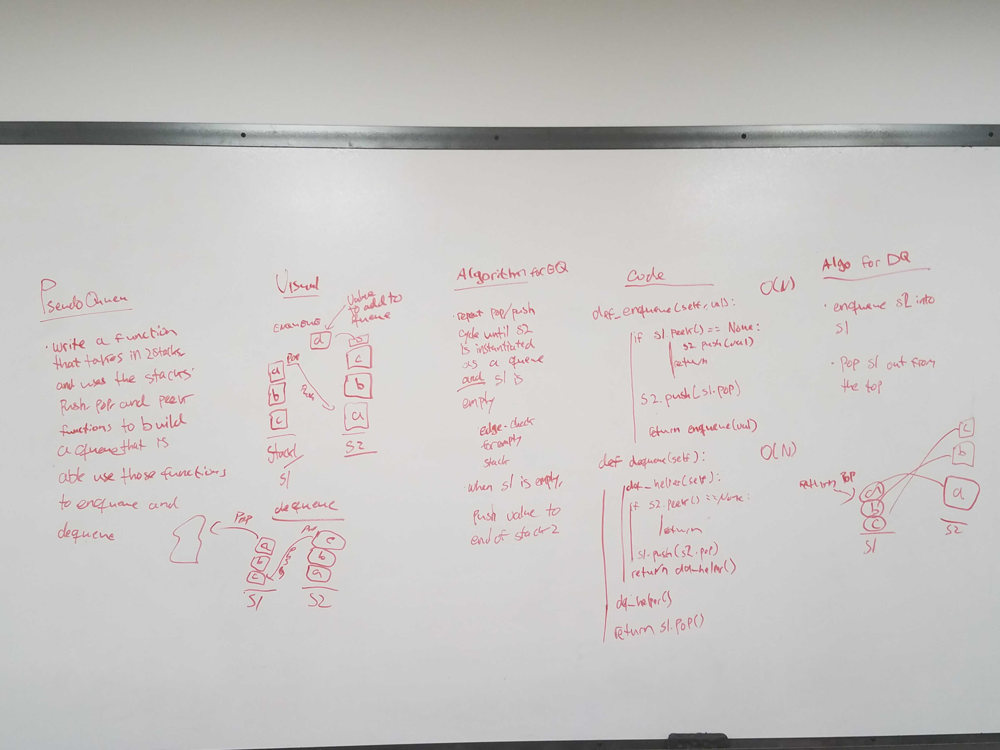

# FIFO Animal Shelter
write a function that simulates an animal shelter. Whoever's been there longest gets adopted first.

## Challenge
Create a class called AnimalShelter which holds only dogs and cats. The shelter operates using a first-in, first-out approach.

Implement the following methods:
enqueue(animal): adds animal to the shelter. animal can be either a dog or a cat object.

dequeue(pref): returns either a dog or a cat. If pref is not "dog" or "cat" then return null.

## Approach & Efficiency
Currently having some trouble getting tests to run properly, notes written, logic written, need better ways to check against pseudo-inputs.

## Solution

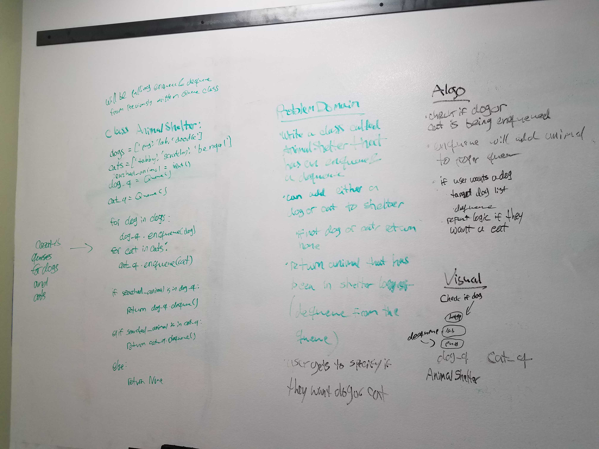

# Multi bracket validation
Create a function called multi_bracket_validation

## Challenge
The function should get diffferent inputs of brackets (letters can be included too), and return True if they're a valid set (such as '[]', '{[]}()'), and return False if they are not (such as '{(})'). It will end up acting similar to a linter

## Approach & Efficiency
I'm checking against counters to see if each string has even the chance of having a mate. If the open and close counts don't match, return False. My main edge-case is currently hard-coded in to be able to pass. My initial idea was to test it against counts as the counts are generated, but that didn't work with the rest of it. I would like to refactor when given the time.

## Solution

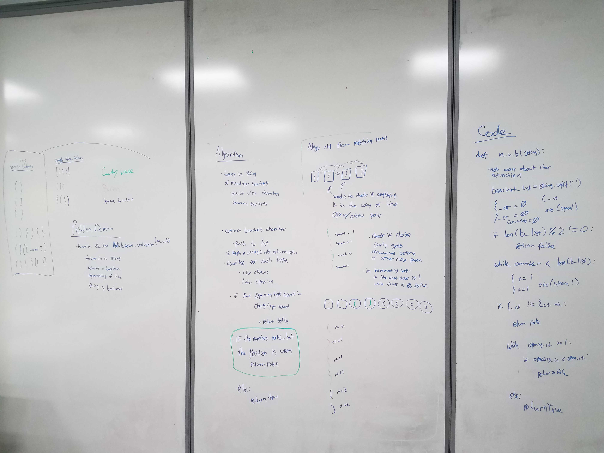

# Trees
Create a basic binary tree, and a binary search tree with add and search methods. 

## Challenge

Create a binary search tree, with methods to add and search the tree.

## Approach & Efficiency

Sought help from  YouTube video on the binary search tree. Tried a few different approaches, but this is the first one I was able to get working. I found it easy to follow too. 

To accurately test my ability to generate a binary search tree from a list of random numbers, I sketched my tree out on a whiteboard.

Thanks to  for explaining the Big O for the trees better than I'd be able to at this point.

The Big O of the Binary Tree (not the search tree) will be O(N) for time,  since it will have to involve the whole tree as a worst-case scenario. The Big O for space is O(log n). 

The Big O for the Binary Search Tree is O(h), the height of the tree. The Big O for a search is O(1), since no extra space is required.

## API
visit traverses the basic binary tree in different manners. Add inserts a node and value onto the binary search tree. Contains traverses the tree searching for a value, and returns a boolean indication whether or not it exists in the tree.

# Fizz buzz tree
Create a function called fizz_buzz_tree, that follows the rules of fizzbuzz to modify a binary tree

## Challenge
Write a function that takes in a binary tree (but not a binary search tree), and replaces values divisibly by 3 and 5 with FizzBuzz, values divisible by 3 with fizz, and values divisible by 5 with buzz.

## Approach & Efficiency
Used former binary tree code to set up a tree for testing. Checked against fizzbuzz conditions first, so they would hit first if something qualified. The visit function traverses the tree recursively, and checks each time. Skyler Burger helped with a small piece of syntax I had missing.

This should run at O(h), where h is the height of the tree.

## Solution

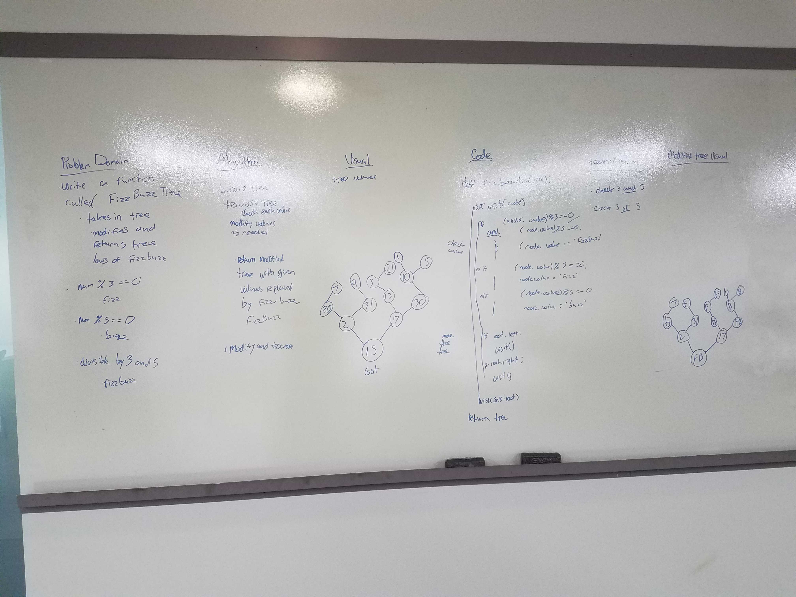

# Breadth-first tree traversal
Traverse a binary tree breadth-first, rather than depth-first

## Challenge
Write a traversal method on a binary tree that takes all the values of the tree, and examines them essentially line by line (see visual in whiteboarded solution), printing out their values.

## Approach & Efficiency

Trying to do this with a while loop, that makes sure there's nodes and values living in the tree, but since the function doesn't recognize the peek method I imported from my previously written queue, my hands are tied until I can figure that out.

Once finished and working, I believe this should run at O(n), since it will have to check each node of the tree, but won't have any nested loops or recursion.
## Solution

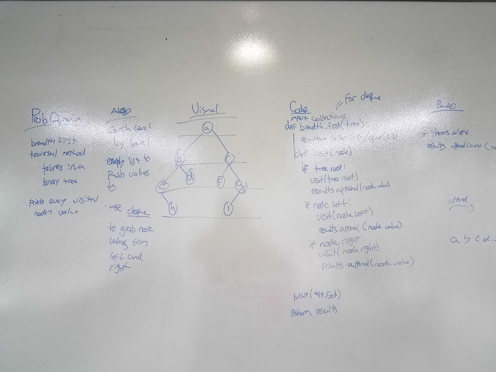

# Max Value In Tree
Find and return the maximum value in a binary tree

## Challenge
Write a function that takes in a binary tree and returns the maximum value it contains.

## Approach & Efficiency

Did this challenge two ways. The first traverses the tree in the same manner my basic binary tree does. It appends each values to a list, then returns the maximum item in that list using python's built-in max function. The Big O of time is O(n). The Big O of space is O(2n), which evens out to O(n).

The second compares values as it traverses the tree, and returns the max value after it finishes traversal. The Big O of time is O(n). The space is O(h), where h is the height of the tree.
## Solution

# Insertion Sort

## Challenge
Sort a list using the insertion method

## Approach & Efficiency
Worked off of given pseudo code to build insertion sort in Python. Relies on switching and inserting variables. Runs at O(n^2). 

## Solution
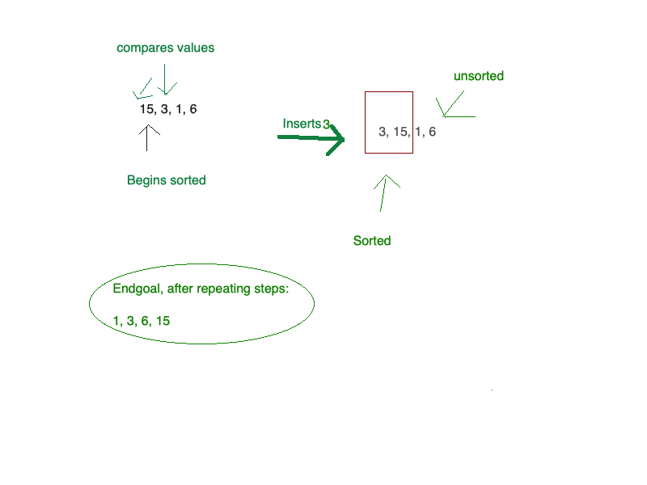

# Merge Sort

## Challenge
Sort a list using the merge method

## Approach & Efficiency
Worked off of given pseudo code to build merge sort in Python. Relies on dividing the given array into smaller arrays, sorting those, and bringing everything back together. Runs at O(nlogn). 

## Solution
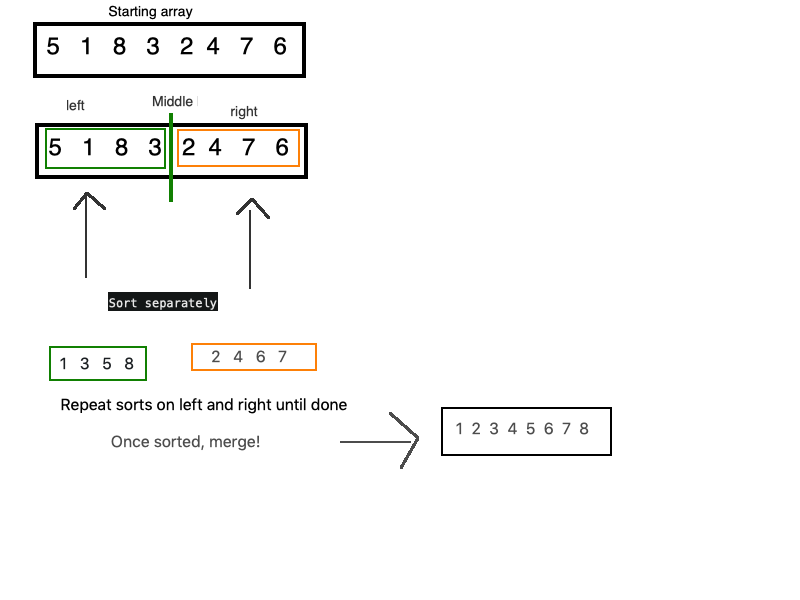

# Quick Sort

## Challenge
Sort a list using the quick sort method

## Approach & Efficiency
Worked off of given pseudo code to build a quick sort algorithm in Python. Works recursively using a divide and conquer strategy to sort subsections of an array at a given pivot point, and return the modified array. While the time complexity will usually run at O(nlogn), in a worst case scenario it will run at O(n^2). In most cases, this will be a more efficient sort than merge sort.

## Solution
[Link to blog](./blogs/BLOG.md)

# Hashtables
A hashtable written in python to accomodate unique key/value pairs

## Challenge
Create a hashtable in python, with methods to: create a hashing index, add key/value pairs, retrieve values based on keys, and check if the table contains a value.

## Approach & Efficiency
Worked from tests and demo code written in class to build the table. Generated a large list of linked lists, so that if collisions occur, the new values can be tacked onto the linked list, rather than overwriting the previously existing values.

## API

Hashing function uses ascii values to generate a number based on the input string (the sum of each ascii value in the string). It is then multiplied by a large prime number, so it has a much lower chance of having the same hashing index as another key, then the modulus of that number is taken. That becomes the hashing index.

Add uses the linked list's insert function to create and append new nodes to the linked list instances.

Get returns the value of a key

Contains returns a boolean checking if the hashtable contains a key or not. This function needs some work to accomodate multiple things being in the table.

# Repeated word
Returns the first repeated word in a sentence

## Challenge
A function that takes in a sentence and returns the first repeated word in that sentence. Returns None if no repetitions.

## Approach & Efficiency

Works off two lists to check for repeated words. The first list is generated by calling split() on my input, so I can iterate over words instead of characters. The second list is build from the first one. This is where I check to see if there are any repeated words.

## Solution
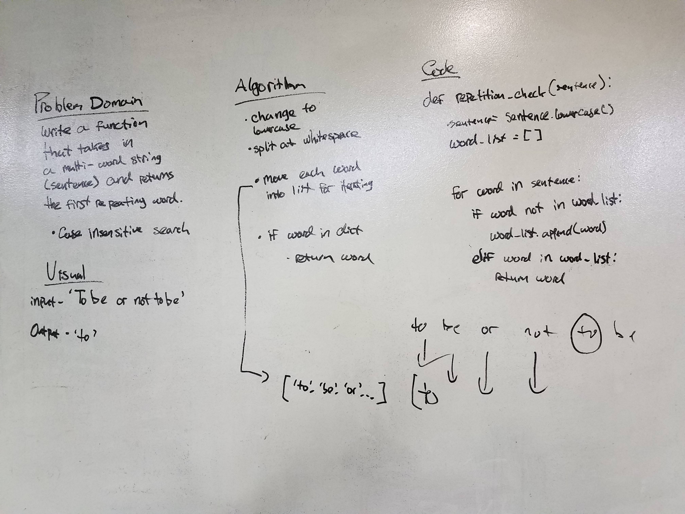

# Repeated word
Compare two binary trees. Return their shared duplicates

## Challenge
Write a function that takes in two binary trees, and returns where they intersect.

## Approach & Efficiency
Runs at O(n) for time, and O(n) for space, although the space will expand always be the O(each tree + 1). The results from calling a traversal function on tree one and tree 2 result in a list. These lists are then compared, and added into the list of duplicates, which gets returned

## Solution
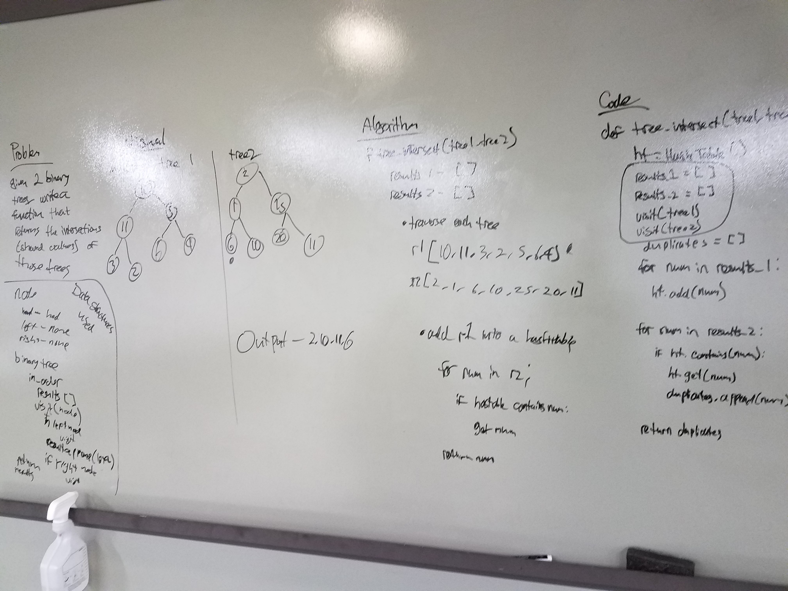

# Left Join
Do a left join on to hash tables.

## Challenge
Compare two hash tables. Left join them so that the returned result contains the key and value from the left table, and the value from the right.

## Approach & Efficiency
As it stands on 8/21, this challenge is partially incomplete. I need to be able to get each key out of the left hash table without knowing the keys, but I am unsure how to do that. Once that part is finished, this function should be nice and modular.

The function compares all the keys in the left table to all the keys in the right table. If the key in the left table matches the key in the right, the entire key/value pair in the left table, and the value from the key in right tree are appended to the list of results. If the key from the left table doesn't match a key in the right table, the value returned for the right table becomes None.

This runs at O(n) for time (subject to change when I make the first part modular), and O(2n) for space.

## Solution
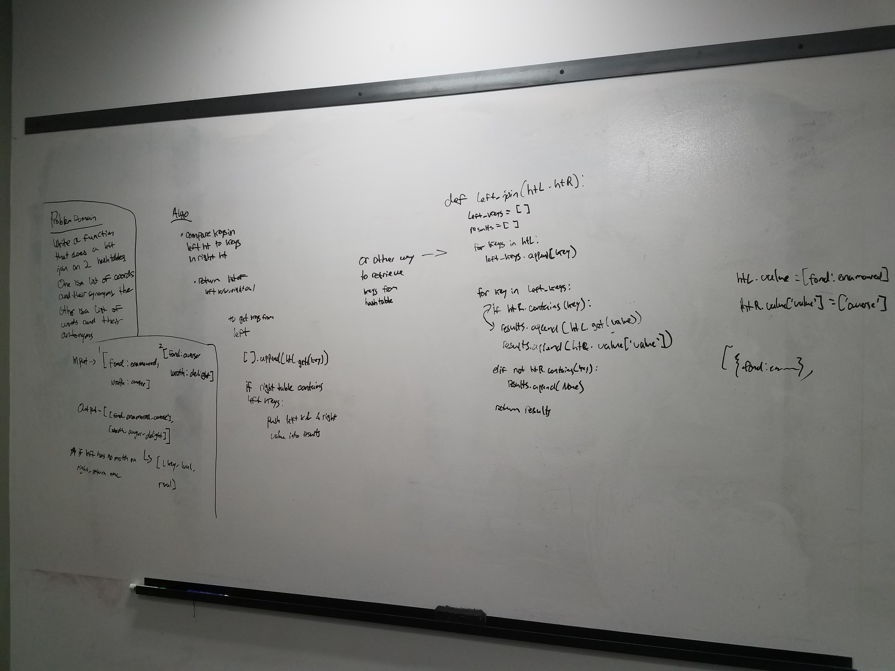

# Graphs
A non-linear data structure made up of a collection of vertices, which can hold a value. 

## Challenge
Implement the basics functions needed to build a graph in python. Work adapted from in-class demo.

## Approach & Efficiency
Used test-driven development tactics to build the graph method by method. Each method has the ability to communicate with the other methods to build various styles of graph.

## API

`add_vertex` takes in a vertex and a value, and adds it into the graph. The vertices do not need to be attached to each other to be part of the graph.

`get_vertices` returns the list of vertices in the graph. If the graph is empty, it will return None.

`add_edge` creates a link (an edge) between vertices in a graph. It can be self-referential, meaning that a vertex can loop back into itself with an edge.

`get_neighbors` will return a list of vertices that share an edge with the given vertex.

# Breadth-first Graph Traversal
Traverse a graph breadth-first and return the results in the order they were visited.

## Challenge
Perform a breadth-first traversal on a graph. Return the values in the graph in the order they were visited.

## Approach & Efficiency
Works as a method built into the rest of the functions that comprise a graph.

Utilizes a double-ended queue (a deque from python's collections library), to control the flow of values for each vertex's neighbors. In it's simplest form, the breadth-first traversal starts with a root value in the queue, enqueues its neighbors, processes them as visited, and moves onto the next set of neighbors. It will never process one vertex's neighbors before it has processed the other vertexes at the same "level" as it.

The operate function, which gets fed into the main function, takes place entirely behind the scenes in a test suite. This one's purpose is to append each value to a list, so it can be treated as results. It keeps the pointer on the right vertex at any given time.

Time-complexity: O(nlogn), although I am unsure of it. While there are nested loops, I don't believe it will ever run at O(n^2), since it doesn't have to iterate over everything twice.

Space-complexity: O(n). Nothing should exponentially expand, although it will be more like O(2n)

## Solution
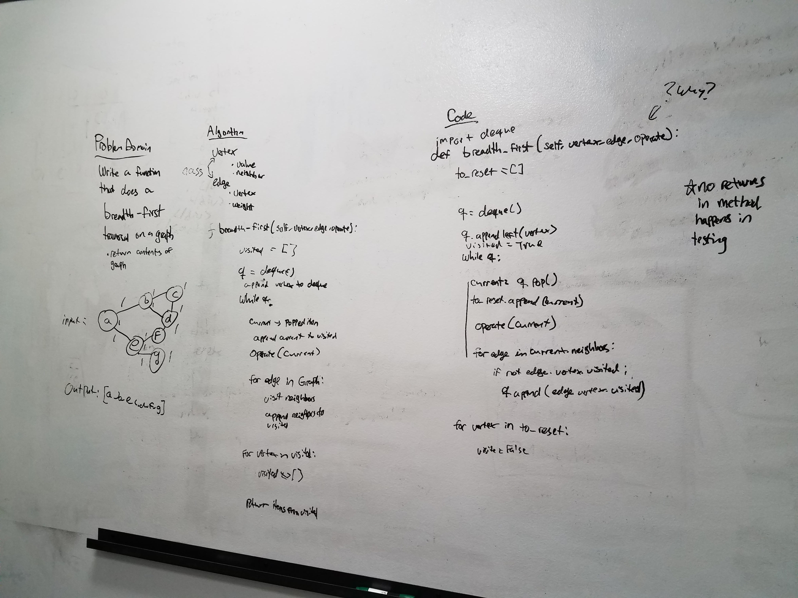