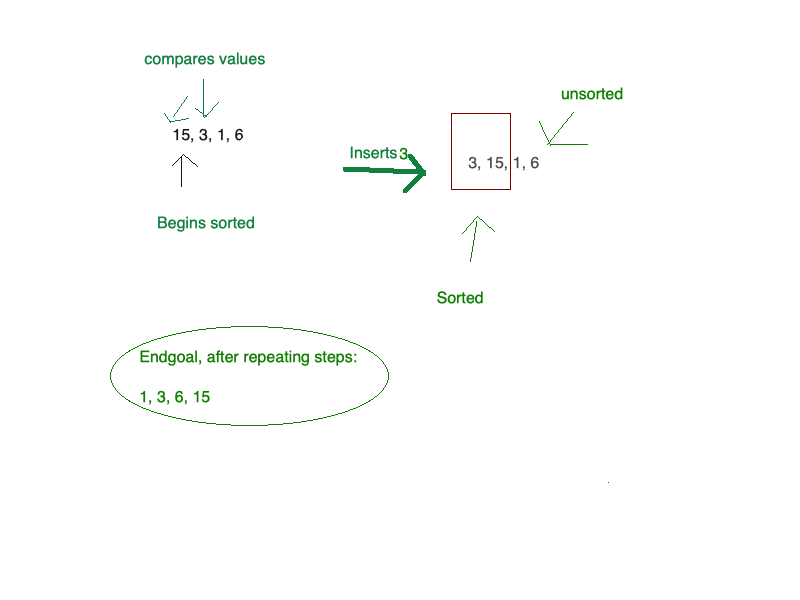

## Blog Notes: Insertion Sort

This is a sorting algorithm that works with two subsets, a sorted and unsorted subset. As the algorithm moves through the list, it inserts elements from the unsorted subset into the sorted subset. It operates by checking the values in a list, and comparing and moving them backwards as needed until the list is sorted.

It is less efficient than many other sorting algorithms, as it runs at O(n^2), which makes it on the same efficiency level as the bubble search. I personally find this more intuitive than the bubble search, since it starts at the beginning of the list.

## Learning Objectives
- Definitions of an insertion sort
- Basic algorithm for an insertion sort
- One way to implement it in Python


## Information Flow
- Sorting via insertion method
    - The algorithm
- References and visuals
    - Visual diagram
    -  Additional readings and references

## Diagram


## Algorithm

The algorithm has two loops. The outer loop is a for loop, and relies on the length of the list we're sorting. The inner loop is a while loop. This is where the bullk of the sorting work happens. The variable j intentionally travels one space behind i, which starts by going the length of the list. Temp takes the place of 'i', so 'i' can remain static.

```python
 for i in range(len(lst)):
        j = (i - 1)
        temp = lst[i]
```

As the for loop iterates over the list, j moves backwards, and carries its index of the list with it. 

```python
while j >= 0 and temp < lst[j]:
            lst[j+1] = lst[j]
            j = j-1
```

Finally, the list at the index of j plus 1 takes on the previously set temp value. The modified list may then be safely returned.

## Pseudocode

Pseudocode provided courtest of Codefellows
```
 InsertionSort(int[] arr)
  
    FOR i = 1 to arr.length
    
      int j <-- i - 1
      int temp <-- arr[i]
      
      WHILE j >= 0 AND temp < arr[j]
        arr[j + 1] <-- arr[j]
        j <-- j - 1
        
      arr[j + 1] <-- temp
```


## Readings and References

# Watch

- [Geeks For Geeks algorithm video](https://www.youtube.com/watch?v=OGzPmgsI-pQ)
# Read

- [Medium's BaseCS Insertion Sort Post](https://medium.com/basecs/inching-towards-insertion-sort-9799274430da)

- [Wikipedia's Insertion Sort](https://en.wikipedia.org/wiki/Insertion_sort)
    
# Bookmark

- [Geeks for Geeks' algorithm and code](https://www.geeksforgeeks.org/insertion-sort/)
