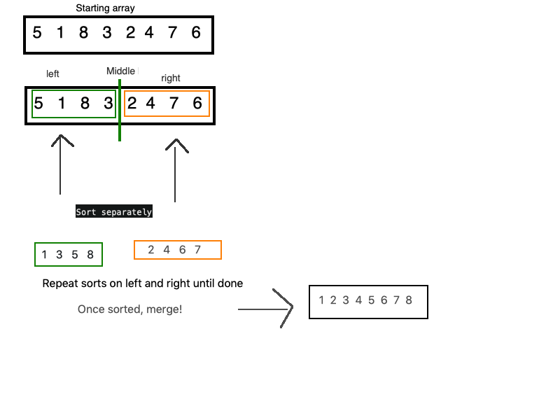

## Blog: Insertion Sort

This is a sorting algorithm that works with two subsets, a sorted and unsorted subset. As the algorithm moves through the list, it inserts elements from the unsorted subset into the sorted subset. It operates by checking the values in a list, and comparing and moving them backwards as needed until the list is sorted.

It is less efficient than many other sorting algorithms, as it runs at O(n^2), which makes it on the same efficiency level as the bubble search. I personally find this more intuitive than the bubble search, since it starts at the beginning of the list.

## Learning Objectives
- Definitions of an insertion sort
- Basic algorithm for an insertion sort
- One way to implement it in Python


## Information Flow
- Sorting via insertion method
    - The algorithm
- References and visuals
    - Visual diagram
    -  Additional readings and references

## Diagram


## Algorithm

The algorithm has two loops. The outer loop is a for loop, and relies on the length of the list we're sorting. The inner loop is a while loop. This is where the bullk of the sorting work happens. The variable j intentionally travels one space behind i, which starts by going the length of the list. Temp takes the place of 'i', so 'i' can remain static.

```python
 for i in range(len(lst)):
        j = (i - 1)
        temp = lst[i]
```

As the for loop iterates over the list, j moves backwards, and carries its index of the list with it. 

```python
while j >= 0 and temp < lst[j]:
            lst[j+1] = lst[j]
            j = j-1
```

Finally, the list at the index of j plus 1 takes on the previously set temp value. The modified list may then be safely returned.

## Pseudocode

Pseudocode provided courtest of Codefellows
```
 InsertionSort(int[] arr)
  
    FOR i = 1 to arr.length
    
      int j <-- i - 1
      int temp <-- arr[i]
      
      WHILE j >= 0 AND temp < arr[j]
        arr[j + 1] <-- arr[j]
        j <-- j - 1
        
      arr[j + 1] <-- temp
```


## Readings and References

# Watch

- [Geeks For Geeks algorithm video](https://www.youtube.com/watch?v=OGzPmgsI-pQ)
# Read

- [Medium's BaseCS Insertion Sort Post](https://medium.com/basecs/inching-towards-insertion-sort-9799274430da)

- [Wikipedia's Insertion Sort](https://en.wikipedia.org/wiki/Insertion_sort)
    
# Bookmark

- [Geeks for Geeks' algorithm and code](https://www.geeksforgeeks.org/insertion-sort/)


## Blog: Merge Sort

The basic idea of the merge sort is that it takes an array, divides it into smaller arrays, sorts those smaller arrays, and then sticks everything back together. This algorithm works recursively, by calling itself until complete.

This algorithm runs at O(n log n), which makes it more efficient than the inerstion sort above, although less efficient than an algorithm that could run at O(n)

## Learning Objectives
- Definition of a merge sort
- Basic algorithm for a merge sort
- One way to implement it in Python


## Information Flow
- Sorting via insertion method
    - The algorithm
- References and visuals
    - Visual diagram
    -  Additional readings and references

## Diagram


## Algorithm
We'll start with two functions, a `merge_sort`, and a `merge`. The recursion all happens in `merge_sort`, but `merge` does most of the heavy lifting. 

Inside `merge_sort` we'll set up some conditions and some variables:
```
def merge_sort(lst):
    length = len(lst)
    if length > 1:

        middle = length // 2     
        left = lst[:middle]
        right = lst[middle:]

        merge_sort(left)
        merge_sort(right)
        merge(left, right, lst)
    return lst
```

Right now, our array (referred to as lst here), is divided into two sections. The left section is the array until the mid-point, and the right section is the array from the midpoint to the final index. First we call `merge_sort` on the left section, then the right section. Finally, the left and right sections are merge back into the original, now modified, array, which we'll examine more below.

```def merge(left, right, lst):
    i = 0
    j = 0
    k = 0

    while i < len(left) and j < len(right):
        if left[i] <= right[j]:
            lst[k] = left[i]
            i += 1

        else:
            lst[k] = right[j]
            j += 1

        k += 1
```

`i`, `j`, and `k` are all pointers to indices in the array, and the sub-arrays. `i` is attached to the left sub-array, and as it increments it marches towards the end of the left array. `j` does the same for the right array. `k` essentially acts as a placeholder index spot for both sub-arrays. As the alrogithm runs, `k` works with the left and right arrays to traverse and sort them. We have two more loops running independently, which do more work with the individual left and right arrays:

```
while i < len(left):
        lst[k] = left[i]
        i += 1
        k += 1

while j < len(right):
        lst[k] = right[j]
        j += 1
        k += 1
```

In these, the remaining entries in the array are set to the remaining values in the right and left. This allows them to merge together in the main recursive part oft the algorithm.


## Pseudocode

Pseudocode provided courtesy of Codefellows and adapted from Geeks for Geeks
```
 ALGORITHM Mergesort(arr)
    DECLARE n <-- arr.length
           
    if n > 1
      DECLARE mid <-- n/2
      DECLARE left <-- arr[0...mid]
      DECLARE right <-- arr[mid...n]
      // sort the left side
      Mergesort(left)
      // sort the right side
      Mergesort(right)
      // merge the sorted left and right sides together
      Merge(left, right, arr)

ALGORITHM Merge(left, right, arr)
    DECLARE i <-- 0
    DECLARE j <-- 0
    DECLARE k <-- 0

    while i < left.length && j < right.length
        if left[i] <= right[j]
            arr[k] <-- left[i]
            i <-- i + 1
        else
            arr[k] <-- right[j]
            j <-- j + 1
            
        k <-- k + 1

    while i < left.length
       set remaining entries in arr to remaining values in right
       increment i and k

    while i < left.length 
       set remaining entries in arr to remaining values in left
       increment j and k

```


## Readings and References

# Watch

- [Youtube video from Michael Sambol](https://www.youtube.com/watch?v=4VqmGXwpLqc)
# Read

- [Medium's BaseCS Introductory Merge Sort Post](https://medium.com/basecs/making-sense-of-merge-sort-part-1-49649a143478)

- [From Hacker Earth](https://www.hackerearth.com/practice/algorithms/sorting/merge-sort/tutorial/)

Wikipedia is also a useful source here!
    
# Bookmark

- [Geeks for Geeks' algorithm and code](https://www.geeksforgeeks.org/merge-sort/)
I was able to easily adapt parts of this into my algorithm.
